# Official_Website_Vue2

基于开源官网模板进行二次开发（基于 Bootstrap 3 框架组件实现样式）

## 📋 项目简介

这是一个企业官方网站项目，采用 Vue2 + Bootstrap 3 技术栈构建，提供完整的企业官网展示解决方案。

## 📝 版本更新日志

### v0.1.0
- 实现公司信息展示
- 产品列表展示功能
- 咨询联系方式页面
- ⚠️ 静态资源体积过大，后续需要压缩优化

### v0.1.1
- 优化静态图片文件类型
- 完善移动端样式适配
- 新增日志功能
- 修复已知 bugs

### v0.1.2
- 新增用户登录功能
- 新增日志管理功能
- 优化图标展示（支持淘宝、抖音、微信公众号等第三方图标链接展示和跳转）
- 其他功能优化

### v0.1.3
- 修复跳转链接 bug
- 解决定时器销毁问题
- 其他稳定性优化

### v0.1.4
- 新增员工通道页面
- 新增登录接口页面
- 完善后台管理功能

### v0.1.5
- ✨ 新增资源中心页面
- 支持用户浏览和下载官网的技术文档、产品手册等资料

## 📚 技术栈

- **前端框架**: Vue2
- **UI 框架**: Bootstrap 3.3.7
- **构建工具**: Webpack
- **包管理**: npm/yarn

## 📖 Bootstrap 3.3.7 官方文档

| 资源类型 | 链接 | 说明 |
|---------|------|------|
| 英文官方文档 | [Bootstrap 3.3.7 Docs](https://getbootstrap.com/docs/3.3/) | 最权威的原始文档，内容最全面 |
| 中文文档 | [Bootstrap中文网 v3.3.7](https://v3.bootcss.com/) | 完整的官方中文翻译，非常适合中文用户 |

## 🚀 快速开始
``` bash
安装依赖
npm install
启动开发服务器
npm run dev
构建生产版本
npm run build
```
## 📁 项目结构

```
src/
├── assets/ # 静态资源文件
├── components/ # 公共组件
├── router/ # 路由配置
├── view/ # 页面组件
├── api/ # 接口请求
└── utils/ # 工具函数
```

## 🎨 设计规范

- 响应式设计，支持移动端访问
- 统一的 UI 风格
- 符合企业官网的视觉规范



## 📞 联系方式

如有问题，请联系项目维护人员。


